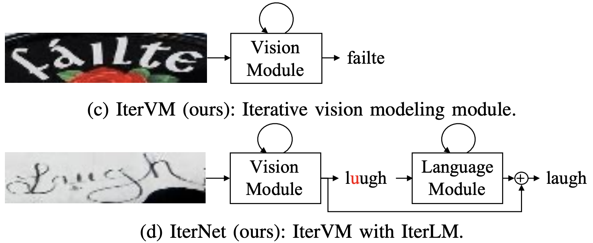

# IterVM: Iterative Vision Modeling Module for Scene Text Recognition

The official code of [IterNet](https://arxiv.org/abs/2204.02630).

We propose IterVM, an iterative approach for visual feature extraction which can significantly improve scene text recognition accuracy.
IterVM repeatedly uses the high-level visual feature extracted at the previous iteration to enhance the multi-level features extracted at the subsequent iteration.





## Runtime Environment
```
pip install -r requirements.txt
```

## Datasets
<details>
  <summary>Training datasets (Click to expand) </summary>
    1. [MJSynth](http://www.robots.ox.ac.uk/~vgg/data/text/) (MJ): 
        - Use `tools/create_lmdb_dataset.py` to convert images into LMDB dataset
        - [LMDB dataset BaiduNetdisk(passwd:n23k)](https://pan.baidu.com/s/1mgnTiyoR8f6Cm655rFI4HQ)
    2. [SynthText](http://www.robots.ox.ac.uk/~vgg/data/scenetext/) (ST):
        - Use `tools/crop_by_word_bb.py` to crop images from original [SynthText](http://www.robots.ox.ac.uk/~vgg/data/scenetext/) dataset, and convert images into LMDB dataset by `tools/create_lmdb_dataset.py`
        - [LMDB dataset BaiduNetdisk(passwd:n23k)](https://pan.baidu.com/s/1mgnTiyoR8f6Cm655rFI4HQ)
    3. [WikiText103](https://s3.amazonaws.com/research.metamind.io/wikitext/wikitext-103-v1.zip), which is only used for pre-trainig language models:
        - Use `notebooks/prepare_wikitext103.ipynb` to convert text into CSV format.
        - [CSV dataset BaiduNetdisk(passwd:dk01)](https://pan.baidu.com/s/1yabtnPYDKqhBb_Ie9PGFXA)
</details>

<details>
  <summary>Evaluation datasets (Click to expand) </summary>
- Evaluation datasets, LMDB datasets can be downloaded from [BaiduNetdisk(passwd:1dbv)](https://pan.baidu.com/s/1RUg3Akwp7n8kZYJ55rU5LQ), [GoogleDrive](https://drive.google.com/file/d/1dTI0ipu14Q1uuK4s4z32DqbqF3dJPdkk/view?usp=sharing).
    1. ICDAR 2013 (IC13)
    2. ICDAR 2015 (IC15)
    3. IIIT5K Words (IIIT)
    4. Street View Text (SVT)
    5. Street View Text-Perspective (SVTP)
    6. CUTE80 (CUTE)
</details>

<details>
  <summary>The structure of `data` directory (Click to expand) </summary>
- The structure of `data` directory is
    ```
    data
    ├── charset_36.txt
    ├── evaluation
    │   ├── CUTE80
    │   ├── IC13_857
    │   ├── IC15_1811
    │   ├── IIIT5k_3000
    │   ├── SVT
    │   └── SVTP
    ├── training
    │   ├── MJ
    │   │   ├── MJ_test
    │   │   ├── MJ_train
    │   │   └── MJ_valid
    │   └── ST
    ├── WikiText-103.csv
    └── WikiText-103_eval_d1.csv
    ```
</details>

## Pretrained Models

Get the pretrained models from [GoogleDrive](https://drive.google.com/drive/folders/1C8NMI8Od8mQUMlsnkHNLkYj73kbAQ7Bl?usp=sharing). Performances of the pretrained models are summaried as follows:

|Model|IC13|SVT|IIIT|IC15|SVTP|CUTE|AVG|
|-|-|-|-|-|-|-|-|
|IterNet|97.9|95.1|96.9|87.7|90.9|91.3|93.8|

## Training

1. Pre-train vision model
    ```
    CUDA_VISIBLE_DEVICES=0,1,2,3,4,5,6,7 python main.py --config=configs/pretrain_vm.yaml
    ```
2. Pre-train language model
    ```
    CUDA_VISIBLE_DEVICES=0,1,2,3 python main.py --config=configs/pretrain_language_model.yaml
    ```
3. Train IterNet
    ```
    CUDA_VISIBLE_DEVICES=0,1,2,3,4,5,6,7 python main.py --config=configs/train_iternet.yaml
    ```
Note:
- You can set the `checkpoint` path for vision model (vm) and language model separately for specific pretrained model, or set to `None` to train from scratch


## Evaluation

```
CUDA_VISIBLE_DEVICES=0 python main.py --config=configs/train_iternet.yaml --phase test --image_only
```
Additional flags:
- `--checkpoint /path/to/checkpoint` set the path of evaluation model 
- `--test_root /path/to/dataset` set the path of evaluation dataset
- `--model_eval [alignment|vision]` which sub-model to evaluate
- `--image_only` disable dumping visualization of attention masks

## Run Demo

```
python demo.py --config=configs/train_iternet.yaml --input=figures/demo
```
Additional flags:
- `--config /path/to/config` set the path of configuration file 
- `--input /path/to/image-directory` set the path of image directory or wildcard path, e.g, `--input='figs/test/*.png'`
- `--checkpoint /path/to/checkpoint` set the path of trained model
- `--cuda [-1|0|1|2|3...]` set the cuda id, by default -1 is set and stands for cpu
- `--model_eval [alignment|vision]` which sub-model to use
- `--image_only` disable dumping visualization of attention masks


## Citation
If you find our method useful for your reserach, please cite
```bash 
@article{chu2022itervm,
  title={IterVM: Iterative Vision Modeling Module for Scene Text Recognition},
  author={Chu, Xiaojie and Wang, Yongtao},
  journal={arXiv preprint arXiv:2204.02630},
  year={2022}
}
 ```

## License
This project is based on [ABINet](https://github.com/FangShancheng/ABINet.git) which is under the 2-clause BSD License - see the [LICENSE file](https://github.com/FangShancheng/ABINet/blob/main/LICENSE) for details.
Thanks for their great works.

